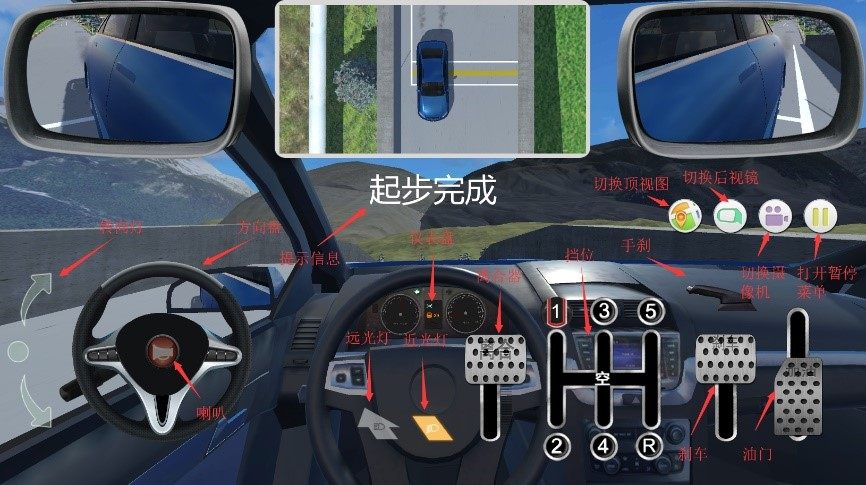

### Easy Driving
一款基于Unity3D开发的科目二模拟驾考软件
 
main code: [Assets/Scripts](Assets/Scripts)
 

#### 界面

    
     
    
图1 开始菜单

 

    
     
    
图2 加载界面

 

    
     
    
图3 车内视角

 

    
     
    
图4 车外视角

 

    
     
    
图5 菜单

 

    
     
    
图6 倒车入库场景

 

#### UML类图设计

    
     
    
图7 汽车动力学仿真模块

 

    
     
    
图8 电器及车身系统模块

 

    
     
    
图9 音效及特性处理模块

 

    
     
    
图10 场景检测器模块

 

    
     
    
图11 界面管理模块

